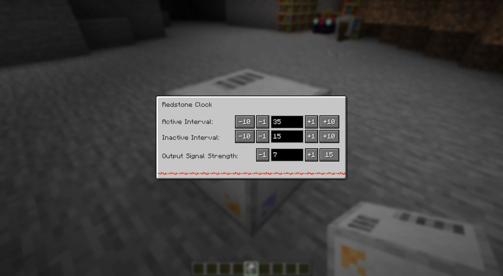

# Redstone Clock Minecraft Mod

This is a Minecraft mod that introduces a simple redstone clock which ticks regularly, with a configurable up and down signal times. It does need to be activated by another redstone signal, though.

Clock in action:

Configuration:

